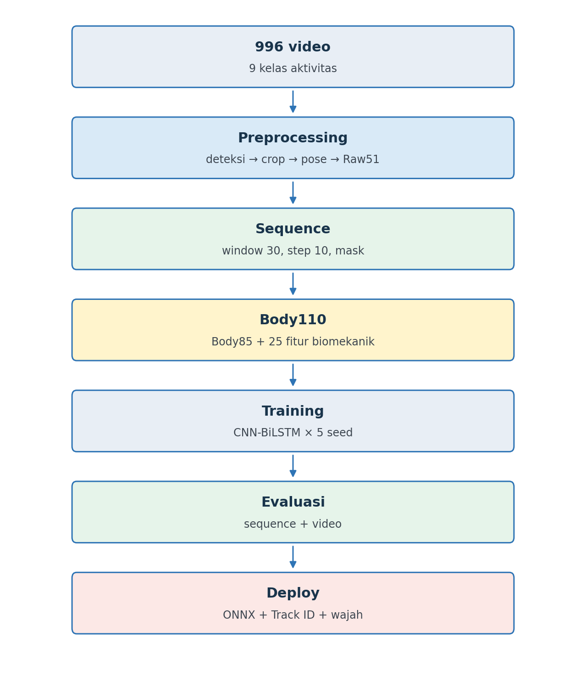

# Thesis UAV — Human Activity Recognition and Face Identification

Implementasi penelitian pengenalan aktivitas manusia pada video UAV menggunakan
YOLOv8s, ByteTrack, YOLO26s-Pose, representasi fitur Body110, CNN-BiLSTM ONNX,
InsightFace, dan MiniFASNetV2.

DJI Tello digunakan sebagai kamera dan pengirim video. Inferensi dijalankan
secara **off-board** pada laptop atau NVIDIA Jetson yang berfungsi sebagai
ground station.

## Alur sistem

```text
Video/Tello
  -> OpenCV
  -> YOLOv8s person detection
  -> ByteTrack (Track ID)
  -> crop manusia
  -> YOLO26s-Pose (17 keypoint)
  -> Raw51: 17 x (x, y, confidence)
  -> sequence 30 frame
  -> Body110
  -> CNN-BiLSTM ONNX
  -> kelas aktivitas + confidence
  -> InsightFace + MiniFASNetV2 (opsional)
```



## Struktur repository

```text
Thesis_UAV/
├── notebooks/
├── src/
├── requirements/
├── models/
├── face_assets/
├── docs/
└── tools/
```

## File utama

- `notebooks/FULL_ONNX_HAR_UAV_Kaggle.ipynb`: pipeline lengkap, termasuk
  multi-person tracking, HAR, wajah, liveness, video, CSV, dan benchmark.
- `notebooks/YOLO_Detector_Pose_Export_ONNX_Kaggle.ipynb`: ekspor YOLO detector
  dan pose ke ONNX secara aman.
- `src/full_pipeline.py`: aplikasi off-board untuk video, webcam, atau DJI Tello.
- `src/body110.py`: transformasi Raw51 menjadi Body110 yang harus identik antara
  training dan inference.
- `src/diagnose_runtime.py`: pemeriksaan CUDA dan ONNX Runtime provider.

## Model yang dibutuhkan

Letakkan file berikut di `models/`:

```text
models/
├── yolov8s.pt atau yolov8s.engine
├── yolo26s-pose.pt atau yolo26s-pose.engine
├── har_window_30_representative.onnx
├── feature_mean.npy
├── feature_std.npy
└── class_mapping.json atau pipeline_metadata.json
```

Notebook Kaggle menggunakan `yolov8s_512_fp32.onnx` dan
`yolo26s-pose_512_fp32.onnx`. Lihat [models/README.md](models/README.md) untuk
aturan Git LFS dan validasi bentuk model. Statistik normalisasi wajib berasal
dari training model HAR yang sama.

## Instalasi lokal

Direkomendasikan menggunakan Python 3.11.

```bash
python -m venv .venv
```

Windows:

```powershell
.venv\Scripts\activate
python -m pip install --upgrade pip
pip install -r requirements/requirements-full.txt
```

Linux:

```bash
source .venv/bin/activate
python -m pip install --upgrade pip
pip install -r requirements/requirements-full.txt
```

## Pengujian

```bash
python src/diagnose_runtime.py
python src/full_pipeline.py --source video --video path/to/video.mp4 --profile quality
python src/full_pipeline.py --source webcam --camera 0 --profile laptop
python src/full_pipeline.py --source tello --profile nano
```

Mode wajah dan liveness:

```bash
python src/full_pipeline.py --source video --video path/to/video.mp4 --profile laptop --enable-face
```

Pada NVIDIA Jetson, gunakan versi PyTorch, TensorRT, dan ONNX Runtime yang
kompatibel dengan JetPack; jangan memaksakan wheel CUDA desktop.

## Privasi dan keselamatan

- Database embedding wajah tidak disimpan di repository publik.
- Jangan commit foto wajah, embedding personal, token, atau credential Kaggle.
- Mode Tello tidak melakukan takeoff otomatis tanpa opsi dan perintah pengguna.
- Pengujian terbang harus dilakukan di area aman dengan baterai cukup dan
  propeller guard.

## Status

- Pipeline ONNX Kaggle: tersedia.
- Multi-person detection dan ByteTrack: tersedia.
- Body110 + CNN-BiLSTM: tersedia.
- Face recognition dan liveness: tersedia sebagai modul opsional.
- Model binary: disediakan terpisah melalui Kaggle/Git LFS karena ukuran dan
  lisensinya.

